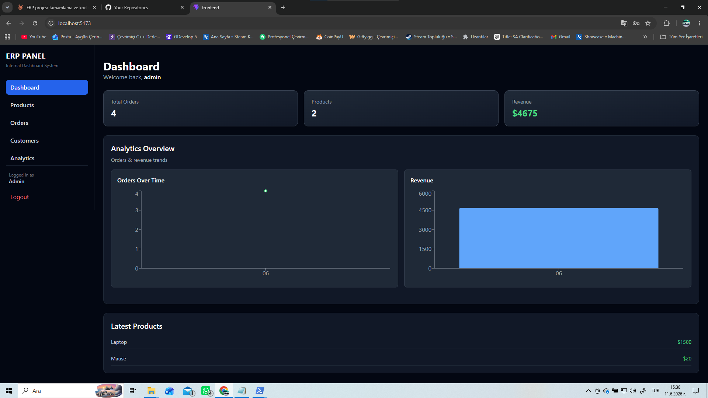
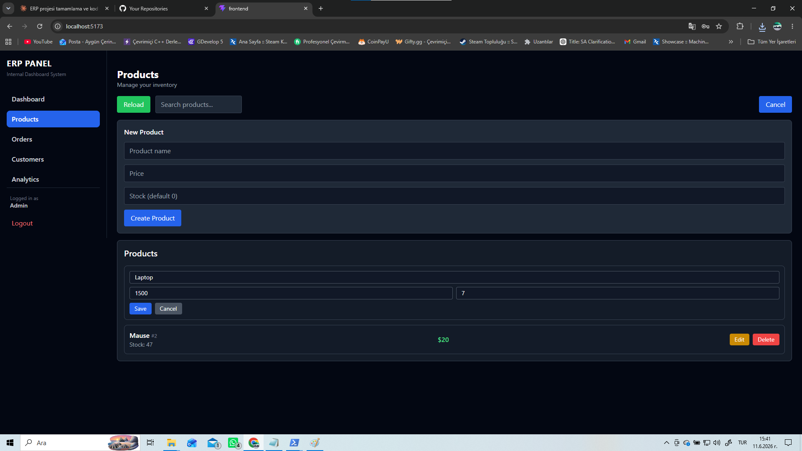
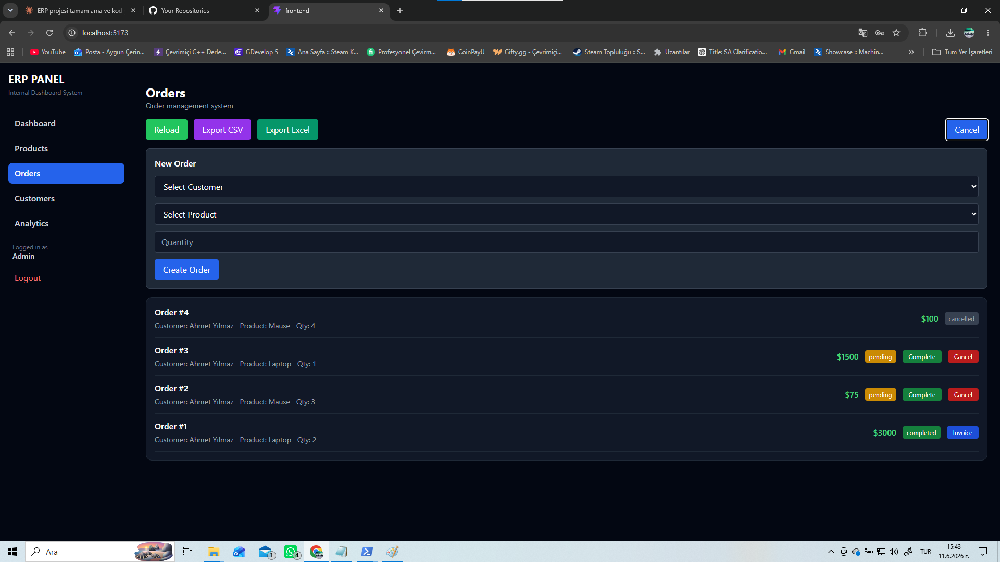
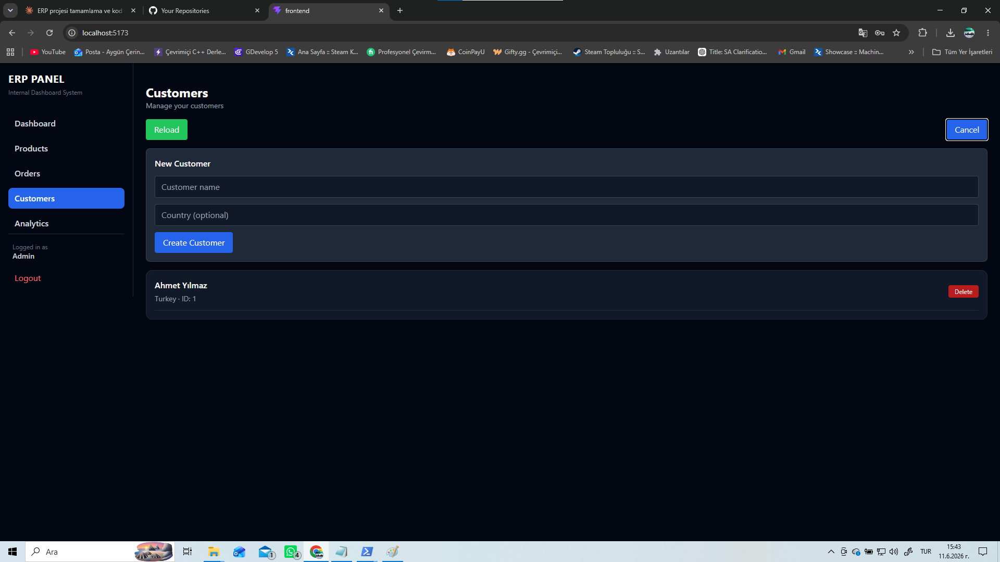
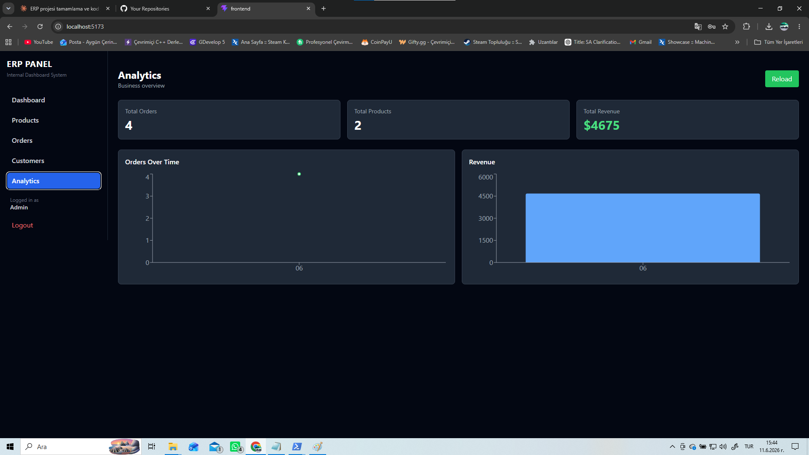
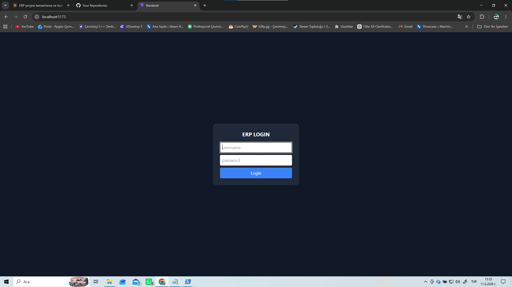

# NexusERP

A full-stack Enterprise Resource Planning (ERP) system built with FastAPI and React. NexusERP provides a complete business management solution with product inventory, order processing, customer management, and analytics dashboard.

## 🚀 Live Demo
- Frontend: [nexuserp-app.netlify.app](https://nexuserp-app.netlify.app)

## ✨ Features

### 🔐 Authentication & Security
- JWT-based authentication
- Role-based access control (Admin / User)
- bcrypt password hashing
- Auto logout on token expiry

### 📦 Product Management
- List, create, update, and delete products
- Real-time stock tracking
- Search and filter
- Pagination

### 🛒 Order Management
- Create orders with customer and product selection
- Stock validation and automatic stock deduction
- Order status tracking (pending → completed / cancelled)
- Database transactions to prevent race conditions
- Cancel order with automatic stock restoration

### 👥 Customer Management
- List, create, and delete customers
- Customer country information

### 📊 Analytics Dashboard
- Total orders, products, and revenue overview
- Orders over time chart
- Revenue trend chart

### 📄 Export & Reports
- Export orders to CSV
- Export orders to Excel (.xlsx)
- Generate PDF invoices for completed orders

### 📱 UI/UX
- Responsive design with mobile hamburger menu
- Dark theme
- Toast notifications
- Loading skeletons
- Optimistic UI updates with React Query

## 🛠️ Tech Stack

### Backend
| Technology | Purpose |
|-----------|---------|
| FastAPI | REST API framework |
| SQLite | Database |
| JWT (python-jose) | Authentication |
| bcrypt | Password hashing |
| python-dotenv | Environment config |
| Uvicorn | ASGI server |

### Frontend
| Technology | Purpose |
|-----------|---------|
| React 18 | UI framework |
| Vite | Build tool |
| React Query | Server state management |
| Axios | HTTP client |
| Tailwind CSS | Styling |
| Recharts | Charts |
| jsPDF | PDF generation |
| SheetJS (xlsx) | Excel export |

## 📁 Project Structure

```
NexusERP/
├── backend/
│   ├── routes/
│   │   ├── auth.py
│   │   ├── products.py
│   │   ├── orders.py
│   │   ├── customers.py
│   │   └── admin.py
│   ├── auth.py
│   ├── database.py
│   ├── security.py
│   ├── main.py
│   └── requirements.txt
├── frontend/
│   └── src/
│       ├── api/
│       ├── components/
│       ├── features/
│       │   ├── dashboard/
│       │   ├── products/
│       │   ├── orders/
│       │   ├── customers/
│       │   └── stats/
│       ├── layouts/
│       └── pages/
└── README.md
```

## ⚙️ Installation & Setup

### Prerequisites
- Python 3.10+
- Node.js 18+

### Backend Setup
```bash
cd backend
python -m venv venv
venv\Scripts\activate  # Windows
pip install -r requirements.txt
uvicorn main:app --reload
```

### Frontend Setup
```bash
cd frontend
npm install
npm run dev
```

### Environment Variables

**backend/.env**
```
SECRET_KEY=your_secret_key_here
DB_NAME=erp.db
```

**frontend/.env**
```
VITE_API_URL=http://localhost:8000
```

## 👤 Default Users

| Username | Password | Role |
|----------|----------|------|
| demo | 1234 | User |

## 📸 Screenshots








## 📝 License
MIT
